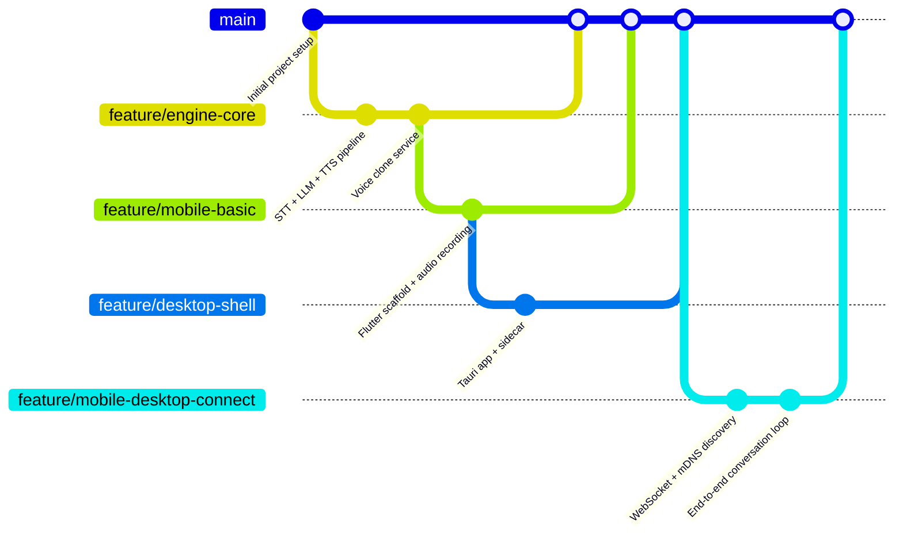

# VoxLingua GitHub Flow 工作流

## 分支策略

本项目遵循 **GitHub Flow**，一种轻量、基于分支的工作流：

```
main (生产分支)
  │
  ├── feature/xxx (功能分支)
  ├── feature/yyy (功能分支)
  └── hotfix/zzz  (紧急修复)
```

### 分支规则

| 分支 | 说明 | 保护规则 |
|------|------|---------|
| `main` | 生产就绪代码 | ✅ 需要 PR 审核，不能直接 push |
| `feature/*` | 新功能开发 | 从 main 创建，合并回 main |
| `bugfix/*` | Bug 修复 | 从 main 创建，合并回 main |
| `hotfix/*` | 紧急修复 | 从 main 创建，合并回 main |

### 工作流流程

1. **从 main 创建功能分支**
   ```bash
   git checkout main
   git pull
   git checkout -b feature/voice-clone
   ```

2. **在分支上开发**
   - 小步提交，每个提交保持独立可运行
   - 提交信息格式：`[模块] 改动说明`
   - 示例：`[engine] Add CosyVoice voice clone integration`

3. **创建 Pull Request**
   - 推送到 GitHub 后创建 PR → `main`
   - PR 标题格式：`[Feature/Bugfix/Hotfix] 简短说明`
   - PR 描述包含：改动内容、测试说明、截图（UI 改动）

4. **CI 自动检查**
   - GitHub Actions 自动运行 lint + test
   - 所有检查通过后才能合并

5. **Code Review**
   - 至少 1 人 Review 通过后合并

6. **合并到 main**
   - 使用 **Squash and Merge**（保持 main 历史干净）
   - 合并后删除功能分支

## 提交信息规范

```
<type>(<scope>): <subject>

[optional body]
```

**Type:**
- `feat` — 新功能
- `fix` — 修复
- `docs` — 文档变更
- `style` — 代码格式
- `refactor` — 重构
- `test` — 测试
- `chore` — 构建/依赖

**示例：**
```
feat(engine): add CosyVoice TTS with zero-shot voice cloning
fix(mobile): resolve WebSocket reconnection infinite loop
docs(protocol): add audio encoding specification
```

## Phase 1 分支计划


